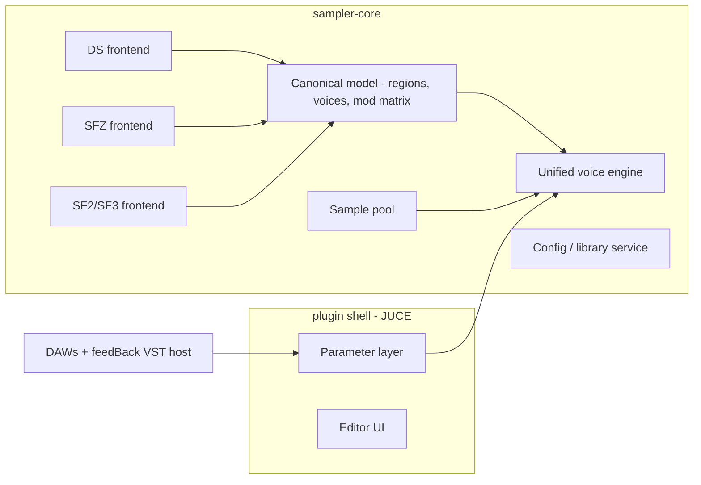
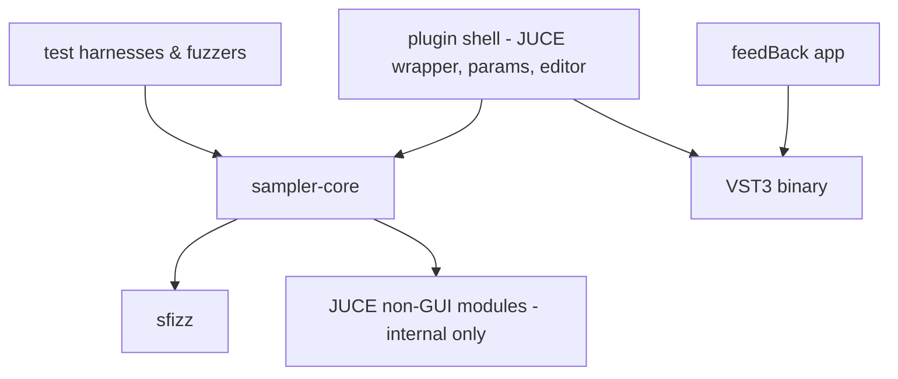

# Architecture Spine — feedBack-sampler

## Design Paradigm

**Compiler pipeline over a layered core/shell split.** Format frontends parse and *lower* each library format into one canonical intermediate representation — the SFZ-superset region/voice/modulation-matrix model — executed by a single voice-engine backend. Everything format-specific ends at lowering; everything after it is format-agnostic. The pipeline lives in `sampler-core` (static lib); the JUCE plugin shell wraps it; feedBack consumes only the finished plugin.



## Invariants & Rules

### AD-1 — One unified voice engine; formats lower, they never synthesize

- **Binds:** FR-1..FR-4, FR-11, FR-13, NFR-1, NFR-3, NFR-5
- **Prevents:** per-format synthesis backends bifurcating RT-safety, streaming, voice stealing, and the v2 author API
- **Rule:** every format lowers at load time into the single canonical model; the mod matrix is extended with SF2 curve/source primitives rather than adding an SF2 voice path. FluidSynth is a test oracle only — never a runtime dependency. The unified-engine invariant is primary; sfizz is the adopted foundation and is replaceable without violating it.

### AD-2 — One sample pool owns all sample memory and disk I/O [ADOPTED]

- **Binds:** FR-8, FR-14, NFR-1, NFR-2, NFR-7
- **Prevents:** per-format sample handling; mmap page-fault RT violations; RAM-only design that can't retrofit streaming
- **Rule:** frontends lower to regions holding references into the pool and never touch disk after lowering. The pool preloads sample heads and streams tails past a configurable RAM budget (sfizz FilePool as adopted shape). SF3 Vorbis is decoded to PCM at load/preload — upstream of the pool SF3 == SF2. Nothing decodes, allocates, locks, or faults on the audio thread. Memory knobs are exactly two: voice limit and pool budget. Pool entries are refcounted and pinned by every live engine snapshot; eviction happens only at refcount zero — the budget may be transiently exceeded during a snapshot handover, never violated by freeing samples a retiring snapshot still streams.

### AD-3 — Three-tier state ownership with single mutation paths

- **Binds:** FR-12, FR-16..FR-19, NFR-1
- **Prevents:** embedded/standalone divergence; DAW projects embedding the library list; UI mutating engine data directly; RT-unsafe mutation
- **Rule:** (1) *Automatable control state* is owned by the host-parameter layer (APVTS); UI and host automation write only through parameters; the audio thread reads them atomically. (2) *Structural state* (loaded library/preset) changes only via a command path: a background loader lowers to a complete immutable engine model delivered to the audio thread as an atomic snapshot swap, retired off-thread; engine data is never mutated incrementally. A library switch keeps the old snapshot audible until the new one is playable-ready (per FR-14 preload), then swaps — no silence gap, no host dropout. (3) *Shared persistent config* (folders, library index, settings) is owned by core's config service in a per-user store, outside plugin state. Host-saved plugin state contains only: library reference + soundfont-preset index + parameter values, in a schema-versioned chunk.

### AD-4 — Saved library references are resolvable identities, not paths

- **Binds:** FR-16, FR-19
- **Prevents:** DAW projects breaking when users reorganize sample folders
- **Rule:** plugin state stores format + library name + library-folder-relative path. Resolution order is fixed: (1) exact relative path under its recorded library folder; (2) index lookup by format + name; (3) after a forced index reload, still unresolved → explicit missing-library UI state with a user locate action — never silence, never a crash, never a bare absolute path as the primary key. A file loaded from outside any library folder (e.g. drag-and-drop) is first registered into the library index as a single-file entry so it has an identity. When the user relocates a library root, the old→new root mapping persists in the config store and resolution consults it.

### AD-5 — feedBack integrates the sampler only as a standard VST3

- **Binds:** FR-15, FR-18, FR-19
- **Prevents:** a bespoke in-process embed path forking behavior, state handling, and testing between app and DAW
- **Rule:** feedBack loads the same plugin binary through its existing VST host; MIDI routing, editor embedding, and session persistence go through the host like any other VSTi. No static-lib embed target for the app. The app inherits fault isolation from the host sandbox. Delivery: feedBack's installer bundles the plugin (standard per-platform VST3 location); the public download ships the identical binary; feedBack requires ≥ its bundled plugin version and otherwise treats it as an ordinary VST3 — no bespoke app↔plugin compatibility contract.

### AD-6 — Core/shell dependency rule

- **Binds:** all
- **Prevents:** engine code growing UI/host dependencies; JUCE types leaking into the engine contract and blocking future consumers
- **Rule:** `sampler-core` is a static-lib target with zero UI/host/editor dependencies; it may use JUCE non-GUI modules internally, but its public API speaks only its own types + std. The shell depends on core; core never depends on the shell. Dependency direction is enforced in the build (separate CMake targets; core links no JUCE GUI module).



### AD-7 — Binding performance budget

- **Binds:** FR-13, NFR-2, NFR-3, NFR-7
- **Prevents:** "fast enough on my machine" drift; performance regressions landing unnoticed
- **Rule:** 128 voices of a typical piano library ≤ 25% of one modern desktop core at 48 kHz/256 samples; fixed engine overhead ≤ 150 MB beyond the sample pool; library switch (command → audible) ≤ 2 s for an indexed library. DSP inherits sfizz's SIMD dispatch — no hand-rolled DSP paths. Enforcement: absolute numbers are validated on a pinned reference machine per release; CI asserts regression-relative (ratio against a baseline recorded on the same runner class), since raw CI hardware is heterogeneous.

### AD-8 — Fixed proxy-parameter pool of 128

- **Binds:** FR-12, FR-17
- **Prevents:** per-library parameter counts colliding with VST3's no-growth-after-instantiation rule
- **Rule:** every library-defined control gets a **stable control ID** minted at lowering (format-defined identity: DS control id/name, SFZ CC number/label — never list position). The control map assigns controls to a pre-allocated pool of 128 proxy parameters; plugin state and automation re-associate by control ID on load, so a library update that reorders or inserts controls never retargets saved automation. Controls beyond 128 remain operable in the UI but are not host-automatable. Generic controls are fixed, separately-identified parameters and never consume proxies.

### AD-9 — Global config: versioned JSON, atomic writes, one owner

- **Binds:** FR-7, FR-10, FR-19
- **Prevents:** app and DAW instances corrupting or forking the shared store; old binaries mangling newer files
- **Rule:** `settings.json` + `library-index.json` live in the platform per-user config dir, written only by core's config service via temp-write + atomic rename. Files carry a schema version and a monotonic generation counter; a writer re-reads and merges the current file before writing (per-entry merge for the index; last-writer-wins per setting), so concurrent instances never wholesale clobber each other's scan results. Migration is forward-only; a newer schema than the binary knows fails soft (read-only + user notice). There is exactly one write path: core's config service inside a plugin instance (or a shipped CLI tool that links core) — feedBack manages folders through the hosted plugin's settings surface, never by writing the files itself. A future index backend (e.g. SQLite) swaps behind the same service API — internal, not a spine change.

### AD-10 — Fidelity and safety infrastructure is architecture

- **Binds:** FR-5, FR-6, NFR-1, NFR-4, NFR-5
- **Prevents:** fidelity claims without measurement; parser crashes reaching hosts; RT violations landing silently
- **Rule:** four harnesses drive `sampler-core` directly and gate CI: (1) golden-file lowering snapshots (library → canonical-model dump) per format; (2) offline corpus rendering regression diffed against FluidSynth / Sforzando references within NFR-5 thresholds; (3) per-frontend fuzzers — a frontend returns structured diagnostics, never throws across the core API, never crashes; (4) debug-build allocation/lock detectors around the audio callback. CI builds and tests all three platforms on every change; pluginval strictness ≥ 5 is a floor, 10 the target. Corpus composition weights real-world usage — SFZ v2/ARIA gaps in sfizz (~44% coverage) are tracked per-library, not per-opcode. Release-platform sequencing (OQ-1) is a release decision and never an architecture one.

### AD-11 — The canonical model is a versioned contract, not a convention

- **Binds:** FR-1..FR-4, FR-6, NFR-5
- **Prevents:** two frontends lowering into privately-interpreted units/defaults that are each "compliant" yet render differently through the same engine
- **Rule:** the canonical model has a written spec in-repo: fixed units (pitch in cents, gain in dB, times in seconds, curves normalized 0..1), explicit defaults for every field, and a schema version stamped into golden files. A frontend is conformant only if its output passes the shared model-validation suite; format-specific semantics must be expressed in model terms at lowering, never carried as frontend-private flags. Control-map entries carry the stable control ID (AD-8) and the display/accessible name from the source format — accessibility metadata survives lowering.

## Consistency Conventions

| Concern | Convention |
| --- | --- |
| Naming | namespace `fbsampler`; files/dirs `snake_case`; types `PascalCase`; functions/vars `camelCase` (sfizz-adjacent) |
| Errors | one `Diagnostic` shape everywhere: severity + stable code + human message + source location; frontends return diagnostics lists, never exceptions across the core API |
| Logging | core never logs directly; it emits through an injected sink; the audio thread never logs, allocates, or formats strings |
| Config & state | every persisted artifact (config files, plugin state chunk, golden files) carries an explicit schema version; migration forward-only |
| Units | audio in float32; time in samples at engine rate inside core; MIDI 1.0 semantics at the boundary |

## Stack

| Name | Version |
| --- | --- |
| C++ | 17 (sfizz-compatible floor) |
| JUCE | 8.0.14 |
| sfizz | 1.2.3, vendored at a pinned commit (upstream cadence stalled — expect local patches) |
| CMake | 3.28+ |
| Catch2 | 3.x |
| pluginval | 1.0.4 pinned; strictness ≥ 5 floor, 10 target |
| CI | GitHub Actions (pamplejuce-style matrix: Windows, macOS, Linux) |
| Targets | VST3 (win/mac/linux), AU (mac); AGPL-3.0 distribution |

## Structural Seed

```text
feedBack-sampler/
  core/                # sampler-core static lib (public API: include/fbsampler/)
    model/             # canonical IR: regions, mod matrix, control map
    frontends/         # ds/, sfz/, sf2/  (sf3 = sf2 + vorbis decode)
    engine/            # unified voice engine (sfizz-based), voice mgmt
    pool/              # sample pool: preload, streaming, budgets
    config/            # config service, library scanner/index
  plugin/              # JUCE shell: processor, APVTS param layer, editor UI
  tests/
    golden/            # lowering snapshots per format
    render/            # corpus rendering regression vs reference engines
    fuzz/              # per-frontend fuzzers
    perf/              # AD-7 budget benchmark
  corpus/              # conformance corpus manifest (FR-6)
  cmake/  .github/
```

## Capability → Architecture Map

| Capability / Area | Lives in | Governed by |
| --- | --- | --- |
| FR-1..4 format playback | `core/frontends` + `core/engine` | AD-1, AD-2 |
| FR-5 load errors, NFR-4 robustness | `core/frontends` | AD-10, Diagnostic convention |
| FR-6 corpus fidelity, NFR-5 | `tests/render`, `corpus/` | AD-10 |
| FR-7..10 library management | `core/config` + editor browser | AD-9, AD-4 |
| FR-11 MIDI, FR-13 polyphony | `core/engine` | AD-1, AD-7 |
| FR-12/17 controls & automation | `plugin` param layer | AD-3, AD-8 |
| FR-14 async loading/streaming | `core/pool` + loader command path | AD-2, AD-3 |
| FR-15..17 plugin/host integration | `plugin` | AD-3, AD-5, AD-10 (pluginval) |
| FR-18/19 feedBack integration | feedBack VST host (external) | AD-5, AD-9 |
| FR-20/21 UI surfaces & design frame | `plugin` editor | UX DESIGN.md / EXPERIENCE.md (adopted) |
| NFR-1..3 RT-safety & performance | `core/engine`, `core/pool` | AD-2, AD-7, AD-10 |
| NFR-6 licensing | whole distribution | Stack (AGPL matrix in PRD addendum) |

## Deferred

- **Voice-stealing policy details** (which voice, fade length) — engine-internal, inherited from sfizz initially; revisit if corpus listening tests flag artifacts.
- **Proxy→control mapping UX beyond declaration order** (MIDI-learn, pinning) — UX owns it; AD-8 fixes only the pool contract.
- **Installer/signing tech per platform** (Inno/pkg/notarization specifics) — release engineering; pamplejuce reference covers it; decide at first public beta (OQ-1 timing).
- **Crash reporting / telemetry** — counter-metric needs signal, but mechanism (none vs. minidump opt-in) is a product/privacy call; decide before public beta.
- **SQLite index backend** — only if library-index scale hurts; AD-9 keeps the swap internal.
- **v2 author API surface** — v1.5 shape is feedBack's plugin API driving the hosted VSTi (AD-5); a real engine API waits for demand and rides the JUCE-free public API of AD-6.
- **feedBack legacy-soundfont sunset** (OQ-3) — product timing; architecture obligation ends at AD-5.
- **Plugin name/branding** (OQ-2) — affects folder/bundle IDs at release; placeholder "feedBack Sampler" until then.
