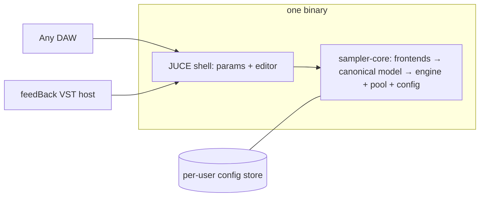

# feedBack-sampler — Solution Design

A readable companion to the architecture spine. The spine (`ARCHITECTURE-SPINE.md`) is the binding contract — terse by design; this document explains the shape of the system and *why* the major calls went the way they did. Where the two disagree, the spine wins.

## The system in one paragraph

feedBack-sampler is a universal sampled-instrument engine that plays the four major open sample-library formats — Decent Sampler, SFZ, SF2, and SF3 — through **one** voice engine. It ships as a single VST3/AU plugin (AGPL-3.0) that DAW users install like any instrument, and that feedBack itself loads through its existing VST host: one binary, two audiences. Architecturally it is a *compiler*: format frontends translate ("lower") each library into a canonical region/voice/modulation-matrix model, and everything downstream of that translation — voices, streaming, polyphony, parameters — is format-agnostic.

## Why a compiler pipeline (AD-1, AD-11)

The defining risk of a multi-format sampler is quiet bifurcation: an SF2 code path here, an SFZ special case there, until there are four samplers in a trench coat — four RT-safety surfaces, four streaming implementations, four voice-stealing behaviors, and a v2 API that can't span them. The alternative considered was a dedicated SF2 voice path (embedding FluidSynth/FluidLite at runtime), which buys soundfont fidelity cheaply but costs exactly that bifurcation, permanently.

The decision: **everything lowers, nothing else synthesizes.** sfizz's modulation matrix gets extended with the SF2 primitives it lacks (curve types, source semantics), and SF2/SF3 presets translate into the same model SFZ uses. FluidSynth still matters — as the *behavioral oracle* in the rendering-regression suite, where its correctness is borrowed without inheriting its runtime. The corpus-based fidelity metric (render real libraries, diff against the oracle, per-release scoreboard) is what makes this bet safe to take incrementally: exotic SF2 modulator behaviors can land over releases without blocking launch, exactly like the SFZ v2 long tail.

AD-11 exists because a "canonical model" that lives only in code comments isn't a contract. Two frontends can both claim compliance while disagreeing about default envelope times or whether gain is linear or dB — and the engine renders both without complaint, just differently. So the model has a written spec: fixed units, explicit defaults, a schema version, and a validation suite every frontend must pass.

## One engine, one pool, one snapshot at a time (AD-2, AD-3)

Sample memory follows the same unification logic. A single sample pool owns every byte of sample data and all disk I/O: it preloads sample heads, streams tails past a RAM budget (sfizz's FilePool shape), and decodes SF3's Vorbis to PCM at load time so the audio path never knows SF3 existed. Memory-mapped files were rejected — page faults on the audio thread are the RT violation you can't reliably test for.

State is split three ways, each with exactly one owner and one mutation path:

1. **Control state** (knobs, automation) lives in the host-parameter layer. UI and host automation both write through parameters; the audio thread reads atomically.
2. **Structural state** (which library is loaded) changes only by command: a background loader builds a complete, immutable engine model, the audio thread swaps to it atomically, and the old model retires off-thread — staying audible until the new one is playable, so switching libraries never gaps or glitches. Pool entries are refcounted and pinned by live snapshots; nothing a retiring snapshot still streams can be evicted.
3. **Shared config** (library folders, the scanned index, settings) lives in a per-user store owned by core's config service — outside plugin state, so a DAW project never embeds the library list, and feedBack and every DAW instance see the same libraries (FR-19).

DAW-saved plugin state is deliberately tiny: a resolvable library identity (not an absolute path — users reorganize sample folders constantly), the soundfont-preset index, and parameter values keyed by **stable control IDs**. That last detail (AD-8) came out of adversarial review: mapping library controls to proxy parameters by declaration order means a library *update* silently retargets saved automation. IDs minted from format-defined identity fix that.

## One plugin, hosted everywhere (AD-5)

The original research assumed feedBack would embed the engine as a static library. During architecture this was overturned: feedBack already ships a VST host, so the app simply hosts the same plugin binary everyone else downloads. This is the single biggest simplification in the design — one artifact to build, test, and debug; fault isolation via the host sandbox for free; the embedded-vs-standalone divergence class eliminated by construction. The engine-core/plugin-shell split survives (AD-6) for testability and the future author API: core may use JUCE internally, but its public API speaks only its own types, keeping a JUCE-free engine reachable if it's ever needed.

Delivery: feedBack's installer bundles the plugin into the standard VST3 location; the public download is the identical binary; the app requires ≥ its bundled version and otherwise treats it as an ordinary VST3.

## Quality is infrastructure (AD-7, AD-10)

For a plugin competing with Decent Sampler and Sforzando, "works" is table stakes; the differentiators are fidelity you can prove and performance you can hold. Both are built as CI infrastructure, not manual QA:

- **Golden lowering snapshots** — every corpus library's canonical-model dump is versioned; a frontend change that alters lowering shows up as a diff.
- **Rendering regression** — offline renders of the corpus against fixed MIDI, diffed against FluidSynth/Sforzando within thresholds (NFR-5). This is the per-release fidelity scoreboard the PRD promises.
- **Fuzzers per frontend** — malformed libraries produce diagnostics, never crashes (NFR-4); parsers are the attack surface, and they're isolated pure functions precisely so they can be fuzzed alone.
- **RT-safety detectors** — debug builds assert no allocation/locks in the audio callback.
- **Performance budget** — 128 piano voices ≤ 25% of a core at 48 kHz/256; absolute numbers validated on a pinned reference machine per release, CI catching regressions relatively.

CI builds all three platforms from day one, with pluginval (strictness 5 floor, 10 target), even if the first public beta ships Windows-only — platform sequencing stays a release decision because the architecture never lets platforms rot.

## Notable risks, eyes open

- **sfizz upstream is quiet** (last release Jan 2024). It's vendored at a pinned commit; local patches are expected. The unified-engine invariant deliberately doesn't depend on sfizz-the-project, only sfizz-the-code — it can be forked or replaced behind the canonical model.
- **SF2 modulator fidelity** is the bet AD-1 makes. The mitigation is the oracle-diffing regression suite and the 90%-renders-correctly gate: fidelity is measured, published, and improved per release rather than promised.
- **SFZ v2/ARIA coverage** inherits sfizz's ~44%; the corpus is weighted by what real libraries actually use, so the number that matters is library coverage, not opcode coverage.
- **Decent Sampler is a moving, vendor-controlled format**: audio behavior is the conformance target; the UI layer is best-effort per release.

## What was deliberately not decided

Voice-stealing tuning, MIDI-learn UX, installer/signing specifics, crash-reporting mechanism, a SQLite index backend, the v2 author-API surface, the legacy-soundfont sunset in feedBack, and the plugin's public name. Each has an owner and a revisit condition in the spine's Deferred section — they're postponed on purpose, not forgotten.
